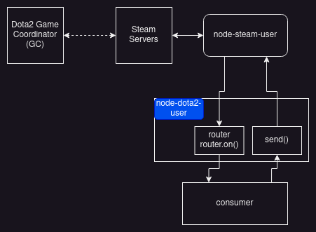

# Steam Interaction

Glossary:
* Steam User - [node-steam-user](https://github.com/doctorMcKay/node-steam-user)
* Dota 2 User - `node-dota2-user`
* GC - Game Coordinator
* CM - Connection Manager
* Protobuf - [Protocol Buffers](https://en.wikipedia.org/wiki/Protocol_Buffers)

I learnt how GC & Steam interactions worked by reading Steam User code and [SteamKit](https://github.com/SteamRE/SteamKit) code.
Please expect some gaps.

[This section on the Valve developer wiki](https://developer.valvesoftware.com/wiki/Counter-Strike:_Global_Offensive_Economy_Items#Preview_Protocol_Implementation) is the only official source I've seen thus far that explains how a GC interaction works. I will refer to this later.

To summarise part of the diagram:
* The Steam CM Servers _somehow_ communicate to a game's GC. This is not visible as it's entirely in Valve's space.
* A Steam Client communicates via [TCP or WebSockets](https://github.com/doctorMcKay/node-steam-user#protocol) to Steam's CM servers. In our case, this is all handled by the Steam User module.
* Messages contain two things: a message ID, and a protobuf serialised payload in binary data format.
    * You may be familiar with serialising data using [JSON](https://en.wikipedia.org/wiki/JSON) or [XML](https://en.wikipedia.org/wiki/XML) via a text based protocol such as HTTP. This is not the case here.
* To send or receive a message, you need the following:
    * A "message ID", which is a number. Each message ID is mapped to a human readable name on an enum in the protobuf files
    * A corresponding protobuf definition for the message ID. This is the data structure schema for the message ID, it specifies how to serialise and de-serialise a payload for that message ID
* The challenge comes with mapping a message ID to the corresponding protobuf definition. Valve has human readable names for each, but an inconsistent naming convention, and it requires a lot of trial and error to get correct. Some Valve systems are better than others.

Now with some context on messages, we can refer back to [the post linked earlier](https://developer.valvesoftware.com/wiki/Counter-Strike:_Global_Offensive_Economy_Items#Preview_Protocol_Implementation) where Valve provide a real world example on how to communicate with the CS:GO GC.
* Note they use the term "protobuf command" which is a "message ID".
* Sending a message
  * The message they wish to send has ID `9156`, and has a human readable name `k_EMsgGCCStrike15_v2_Client2GCEconPreviewDataBlockRequest` in the `ECsgoGCMsg` enum.
  * The corresponding protobuf definition for `9156` is named `CMsgGCCStrike15_v2_Client2GCEconPreviewDataBlockRequest`
  * We can infer this is the protobuf definition based on the name, in this case we can simply substitute `k_EMsg` with `CMsg` to find the correct message. It's not always this simple.
* Assuming a client serialises a payload correctly with the `CMsgGCCStrike15_v2_Client2GCEconPreviewDataBlockRequest` protobuf, and sends a message with message ID `9156`
* Receiving a message
  * The CS:GO GC will respond with a message ID `9157`, which has a human readable name `k_EMsgGCCStrike15_v2_Client2GCEconPreviewDataBlockResponse` in the `ECsgoGCMsg` enum.
  * The corresponding protobuf definition for `9157` is `CMsgGCCStrike15_v2_Client2GCEconPreviewDataBlockResponse`
  * Again the protobuf definition is simple to infer, simply substitute `k_EMsg` with `CMsg`.
  * If a client de-serialises the payload with the `CMsgGCCStrike15_v2_Client2GCEconPreviewDataBlockResponse` schema, they will receive a payload with a nested object of type `CEconItemPreviewDataBlock`, which contains their desired info.

OK... how does this module fit in?:
* The Steam User module [provides an interface for communicating with a GC](https://github.com/DoctorMcKay/node-steam-user/wiki/Game-Coordinator). However it relies on the consumer to serialise and de-serialise protobuf messages themselves.
    * It only exposes a message ID (only the number), and the raw binary data for the message.
* The Steam DB team automatically publish Dota 2 (and other Valve systems) [protobufs here](https://github.com/SteamDatabase/Protobufs). This is consumed as a submodule in this repository.
* By consuming Steam DB's published protobufs, Dota 2 User handles all the serialising and de-serialising as it can infer the message ID <-> protobuf definition mapping
    * The [genny](https://github.com/itsjfx/node-dota2-user/blob/master/src/bin/genny.ts) script is responsible for pre-generating the mappings
    * Why pre-generate? I'd prefer not to pre-generate, however it's not possible to have typed interfaces if this is done at runtime.
* Dota 2 User also handles some basic Dota 2 GC logic such as completing a client handshake, and handling connection state, just like a real Dota 2 client would.
    * There are a couple of unimplemented features still to go... e.g. handling caches, party and lobby state, and other things

How does a user/consumer communicate with the Dota 2 GC using this module?:
* When messages are sent by the Dota 2 GC, there's an event emitted you can listen on to receive a typed payload object
    * There's an underlying Router in Dota 2 User which is message aware, can de-serialise a message, and emit/route/publish the payload with the correct type
* When you wish to send a specific message, the `send()` function definition infers the payload type and provides type hints
* As the Router and `send()` mechanism are both type aware based on the message ID, this means that all known messages to the Dota 2 GC are documented
    * Currently I don't actually auto-generate Markdown documentation (sorry!), so you'll have to rely on type hints from your IDE / or the TypeScript compiler
* To see a real examples of how to communicate with the Dota 2 GC with this module, check out [the examples/ folder](../examples/README.md)

Could this be better?:
* Definitely, I'm sure there's many gaps I want to fill, I'm trying to track things here: <https://github.com/users/itsjfx/projects/1>
* Long term I would love for the Router and `send()` functions to be private, and instead provide auto-generated methods and events with human readable names:
    * `dota2.send(Dota2Protobufs.EDOTAGCMsg.k_EMsgGCMatchDetailsRequest, payload)` becomes `dota2.getMatchDetails()`
    * `dota2.router.on(Dota2Protobufs.EDOTAGCMsg.k_EMsgGCMatchDetailsResponse, (data) => {})` becomes `dota2.on('matchDetails', (data) => {})`
    * [go-dota](https://github.com/paralin/go-dota2) has implemented this interface, but it's a lot of work.
